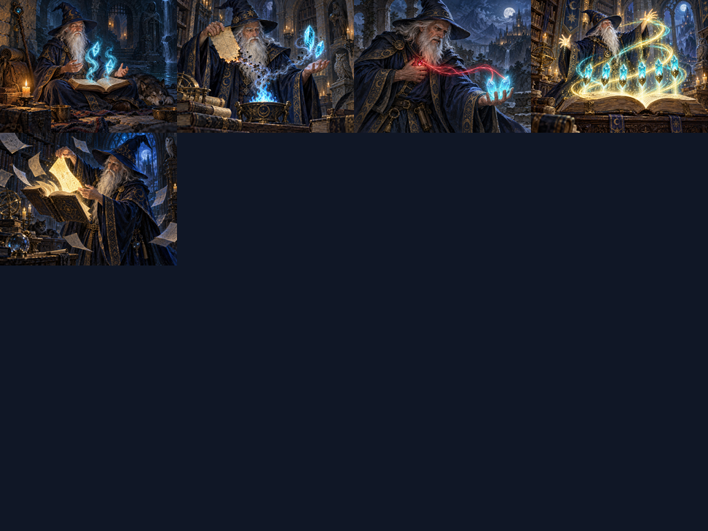

# 奥术法师 / D&D Wizard — Slay the Spire 2

一个以 D&D 法师为灵感的《杀戮尖塔 2》角色模组：**37 张独立插画卡牌、6 件专属遗物、手动升环、超限施法、法术书成长**，支持简体中文和英文。

**当前发布版本：v0.4.0。适配 Windows 游戏 v0.107.1，依赖 BaseLib 3.3.2。v0.4.0 已通过编译、离线规则与资源检查；作者于 2026-10-04 确认已手动测试最新版，未发现问题。**

[下载模组](https://github.com/hanshuqimen/STS2-DndWizard/releases/latest) · [安装指南](docs/INSTALL.zh-CN.md) · [玩法指南](docs/GAMEPLAY.zh-CN.md) · [完整卡牌图鉴](CARDS.zh-CN.md) · [English](README.en.md)



## 玩家安装

1. 退出游戏，找到含有 SlayTheSpire2.exe 的游戏安装目录。
2. 安装 [BaseLib](https://github.com/Alchyr/BaseLib-StS2/releases)，本版开发依赖为 **3.3.2**。其他版本尚未验证。
3. 到 [Releases](https://github.com/hanshuqimen/STS2-DndWizard/releases/latest) 下载 **DndWizard-v0.4.0-sts2-0.107.1.zip**。
4. 将压缩包内的 DndWizard 文件夹放到游戏的 mods 文件夹。
5. 启动游戏并允许加载模组，新开一局选择“法师”。

安装后应为：

```text
<游戏目录>/
  SlayTheSpire2.exe
  mods/
    BaseLib/                 # 单独安装的依赖
    DndWizard/
      DndWizard.dll
      DndWizard.pck
      DndWizard.json
```

不需要 Steam Workshop。**GitHub 的 Source code 压缩包是源码，不是可直接安装的模组。** 玩家请下载上面的专用安装包。更新前建议备份存档与旧模组；旧档迁移未验证。

## 玩法特色

- 能量支付卡牌费用，法术位用于升环，两种资源独立。
- 法术位初始 6/6，跨战斗与存档保存；营火选择“休息”回满，锻造不恢复。
- 主动选择基础施法或升环 1～3 阶；满级法术书解锁四阶。不同法术增加伤害、攻击次数、格挡或控制。
- 每施放两次戏法恢复 1 法术位，每回合最多一次。恢复牌可付出等待、手牌、生命或能量的代价。
- 法术位不足可超限施法，以生命补足缺口，每战一次，界面标明代价。
- 法术书随战斗胜利成长，累计 3/7/12 研习经验升级，提高容量、降低超限血耗并解锁四阶。
- 三种专注互斥：守御、塑能和冥想，分别支持防护、爆发与持续回位。

这是适配尖塔节奏的主题改编。数值、构筑示例和代价说明见 [玩法指南](docs/GAMEPLAY.zh-CN.md)。

## 从源码构建

需要 .NET SDK 10、本地游戏 v0.107.1、BaseLib 3.3.2、独立 Godot 命令行工具，以及 sts2-modding-mcp 的 Python 环境。游戏和依赖程序集由你的本地安装提供。

```powershell
powershell -ExecutionPolicy Bypass -File .\Build.ps1 -GameDir "C:\Games\Slay the Spire 2" -McpRoot "C:\Tools\sts2-modding-mcp" -GodotExe "C:\Tools\Godot\Godot_console.exe"
```

完整准备步骤与 MCP 导入兼容性要求见 [构建指南](docs/BUILD.md)。构建只执行离线检查，不启动游戏。产物位于 dist；加 -Install 可在游戏关闭时安装。

只运行纯规则检查：

```powershell
dotnet run --project tests/Rules/Rules.csproj -c Release
```

## 状态与反馈

v0.4.0：Release 编译零警告、零错误，5,339 项离线规则断言通过，58 张纹理和 3 个场景加载检查通过。37 张卡牌各有独立原稿和 512×384 纹理。作者已手动测试最新版并反馈未发现问题；测试场景未逐项记录，详见 [验证记录](TESTING.md)。

发现问题请提交 [Issue](https://github.com/hanshuqimen/STS2-DndWizard/issues)，附游戏/模组/BaseLib 版本、复现步骤和相关报错。卡牌数值、文本与生成代码入口为 generate_content.py。

## 授权与致谢

项目代码与项目原创素材采用 [MIT License](LICENSE)，素材生成来源见 [素材说明](ASSETS.md)。本仓库与发布包不包含游戏程序集、BaseLib 二进制、游戏提取素材或参考模组文件。游戏、D&D 名称和第三方依赖的权利属于其各自权利人。

参考项目：[TheImmortal](https://github.com/Autmn7/TheImmortal-StS2)、[Marisa](https://github.com/lf201014/STS2_MarisaMod)、[Denia](https://github.com/Sirius882/sts2-wuwa-denia)、[Flagellant](https://github.com/JerryCatJim/Sts2-FlagellantMod)。研究记录见 [REFERENCES.md](REFERENCES.md)。
